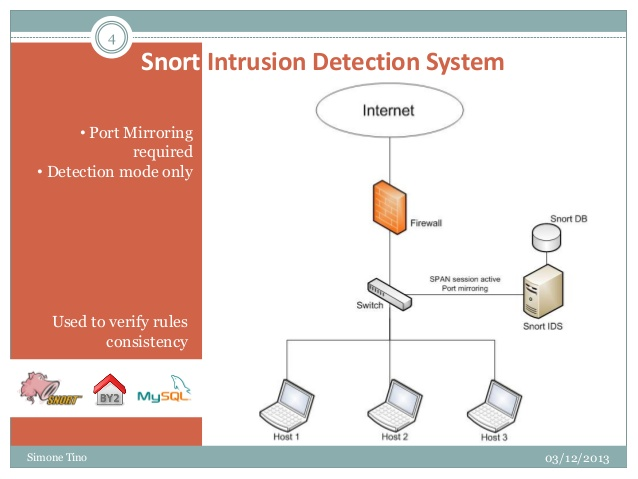
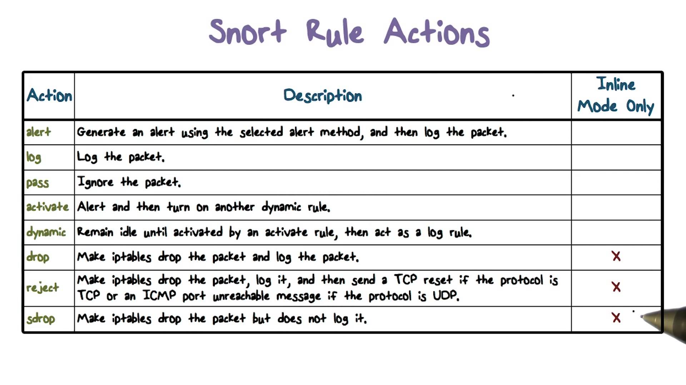
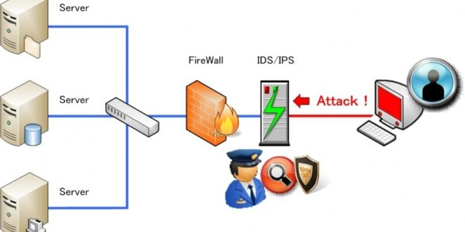
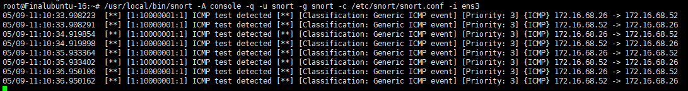
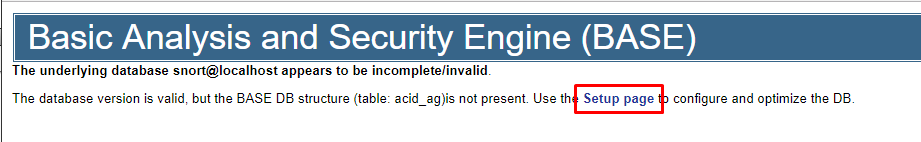
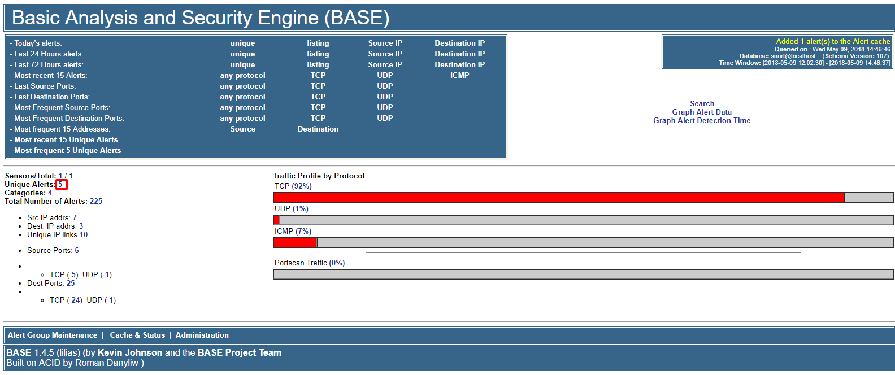

# Mô hình

Sử dụng Snort ở chế độ IDS thì ta sẽ cài đặt Snort trên một máy chủ trong hệ thống (Outline), khi đó, ta cấu hình mirror port để thiết bị SW đẩy dữ liệu 
tới Snort.

**Lưu ý**: Dữ liệu hệ thống của bạn lớn thì phải thiết kế băng thông cho máy chủ Snort và cấu hình máy chủ cũng phải đủ lớn



Nếu bạn muốn sử dụng Snort ở chế độ IPS thì phải thiết lập cho phép Snort đứng trước hoặc sau firewall (Inline). Việc chạy Snort như IPS thì các 
rule sẽ có thêm action: drop, reject, sdrop





# Cài đặt

Tôi thực hiện cài đặt Snort có chức năng là một NIDS outline trong hệ thống theo guilde hướng dẫn từ trang chủ của Snort.

Các package sẽ được cài đặt là:
- Snort: đọc, xử lý phân tích theo các rule được thiết lập.
- Barnyard2: Phần mềm lấy output của Snort và ghi vào CSLD SQL
- PulledPork: Tự động tải các Snort rule miễn phí mới nhất
- BASE: một giao diện đồ họa nền web cho việc xem các Snort event.

## Chuẩn bị

Bạn chuẩn bị một máy chủ cài đặt hệ điều hành Ubuntu server 16.04 x64. Thực hiện update hệ thống
```sh
apt update && apt dist-upgrade -y
```

Nếu chưa có ethtool thì cài đặt thêm
```sh
apt install ethtool -y
```

**NOTE** (đã test cấu hình lro, gro và thấy lỗi nhưng cứ docs lại đây, bạn có thể ko cần cấu hình đoạn sau khi lab, còn khi chạy product thì nên nghiên cứu kỹ):
Một số network card có tính năng gọi là "Large Receive Offload" (lro) và "Generic Receive Offload" (gro). khi kích hoạt tính năng này, 
network card thực hiện lắp ráp lại packet trước khi chúng được xử lý bởi kernel. mặc định, Snort sẽ xóa các packet lớn hơn default snaplen là 
1518 byte. Thêm vào đó, LRO, GRO có thể là nguyên nhân của vấn đề Stream5 target-based reassembly. Vì thế, nên tắt LRO và GRO.

Để tắt LRO và GRO ta sử dụng lệnh ethtool vào file cấu hình interface `/etc/network/interfaces`. Thêm 02 dòng sau vào mỗi interface
```sh
post-up ethtool -K $IFACE gro off
post-up ethtool -K $IFACE lro off
```
Thay thế đúng tên interface của máy bạn và thực hiện khởi động lại interface
```sh
ifconfig eth0 down && ifconfig eth0 up
```
Kiểm tra lại thông số
```sh
ethtool -K eth0 |grep receive-offload
```

Bắt đầu thực hiện cài đặt trước các gói mà Snort cần để chạy:
- pcap
- PCRE
- Libdnet
- DAQ

```sh
apt install -y build-essential
apt install -y libpcap-dev libpcre3-dev libdumbnet-dev
apt install -y bison flex
```

Tạo một thư mục chứa toàn bộ source code cài đặt và cài đặt DAQ
```sh
mkdir -p ~/snort_src
cd ~/snort_src
wget https://www.snort.org/downloads/snort/daq-2.0.6.tar.gz
tar -xzvf daq-2.0.6.tar.gz
cd daq-2.0.6
./configure
make
make install
```

Khi cài đặt có một số `warning` nhưng việc cài đặt vẫn diễn ra bình thường, ko vấn đề gì cả.

## Cài đặt Snort

Cài đặt thêm một số lib cho Snort
```sh
apt install -y zlib1g-dev liblzma-dev openssl libssl-dev libnghttp2-dev
```

Cài đặt Snort
```sh
cd ~/snort_src
wget https://www.snort.org/downloads/snort/snort-2.9.11.1.tar.gz
tar -xzvf snort-2.9.11.1.tar.gz
cd snort-2.9.11.1
./configure --enable-sourcefire
make
make install
```

Chạy lệnh sau để cập nhật thư viện chia sẻ
```sh
ldconfig
```

Đưa liên kết các thư viện của Snort vào /usr/sbin
```sh
ln -s /usr/local/bin/snort /usr/sbin/snort
```

Kiểm tra lại version của Snort sau khi cài xong
```sh
snort -V
```

## Cấu hình Snort chạy NIDS mode

Sử dụng một user khác root để chạy Snort
```sh
# tạo user và group snort
groupadd snort
useradd snort -r -s /sbin/nologin -c SNORT_IDS -g snort

# Tạo các thư mục Snort
mkdir /etc/snort
mkdir /etc/snort/rules
mkdir /etc/snort/rules/iplists
mkdir /etc/snort/preproc_rules
mkdir /usr/local/lib/snort_dynamicrules
mkdir /etc/snort/so_rules

# tạo file để lưu trữ rule và danh sách IP
touch /etc/snort/rules/iplists/black_list.rules
touch /etc/snort/rules/iplists/white_list.rules
touch /etc/snort/rules/local.rules
touch /etc/snort/sid-msg.map

# Tạo thư mục lưu trữ log
mkdir /var/log/snort
mkdir /var/log/snort/archived_logs

# Phân quyền
chmod -R 5775 /etc/snort
chmod -R 5775 /var/log/snort
chmod -R 5775 /var/log/snort/archived_logs
chmod -R 5775 /etc/snort/so_rules
chmod -R 5775 /usr/local/lib/snort_dynamicrules

# Chuyển quyền
chown -R snort:snort /etc/snort
chown -R snort:snort /var/log/snort
chown -R snort:snort /usr/local/lib/snort_dynamicrules
```

Snort cần vài file cấu hình, ta sử dụng các file có sẵn trong source
```sh
cd ~/snort_src/snort-2.9.11.1/etc/
cp *.conf* /etc/snort
cp *.map /etc/snort
cp *.dtd /etc/snort

cd ~/snort_src/snort-2.9.11.1/src/dynamic-preprocessors/build/usr/local/lib/snort_dynamicpreprocessor/
cp * /usr/local/lib/snort_dynamicpreprocessor
```

Tới đây, cơ bản Snort đã được cấu hình xong, ta chỉnh lại một số thông số trong file `/etc/snort/snort.conf` trước khi chạy
```sh
sed -i "s/include \$RULE\_PATH/#include \$RULE\_PATH/ " /etc/snort/snort.conf
```

Sửa thủ công một số thông số khác bằng cách sử dụng lệnh `vim /etc/snort/snort.conf`
```sh
# LINE 45 thay bằng internal network. Nếu muốn dải mạng external thì nên xài !$HOME_NET
ipvar HOME_NET 10.0.0.0/24

# LINE 104
var RULE_PATH /etc/snort/rules
var SO_RULE_PATH /etc/snort/so_rules
var PREPROC_RULE_PATH /etc/snort/preproc_rules

var WHITE_LIST_PATH /etc/snort/rules/iplists
var BLACK_LIST_PATH /etc/snort/rules/iplists

# Sử dụng file local.rules thì tại dòng 546 ta bỏ dấu #
include $RULE_PATH/local.rules
```

Sau khi cấu hình xong, ta verify lại file một lần bằng lệnh
```sh
sudo snort -T -i eth0 -c /etc/snort/snort.conf
```

Viết một rule đơn giản để test Snort Detection. ta mở file `/etc/snort/rules/local.rules` và thêm dòng sau
```sh
alert icmp any any -> $HOME_NET any (msg:"ICMP test detected"; GID:1; sid:10000001; rev:001; classtype:icmp-event;)
```

Tiếp tục thêm dòng cấu hình sau vào rule `/etc/snort/sid-msg.map` để bật trigger cảnh báo
```sh
#v2
1 || 10000001 || 001 || icmp-event || 0 || ICMP Test detected || url,tools.ietf.org/html/rfc792
```

Chạy lệnh sau để chắc chắn đã cấu hình đúng
```sh
snort -T -c /etc/snort/snort.conf -i eth0
``` 

Một số tham số trong lệnh chạy
```sh
-A console
-q
-u snort
-g snort
-c /etc/snort/snort.conf
-i eth0
```

Thực hiện chạy lệnh sau để test
```sh
/usr/local/bin/snort -A console -q -u snort -g snort -c /etc/snort/snort.conf -i eth0
```

Đứng trên máy khác ping tới interface đang được Snort bắt gói sẽ có log tương tự sau:



Tiến hành ping tới IP của eth0 sẽ có log alert được xuất hiện trên màn hình console. Nếu bạn ctrl-c để dừng Snort, các thông tin sẽ lưu vào trong 
thư mục /var/log/snort với tên snort.log.nnnnnn (số có thể khác).

## Cài đặt Barnyard2

Barnyard2 hỗ trợ xuất dữ liệu từ Snort ra CSDL MySQL để các công cụ khác có thể sử dụng được.

Đầu tiên, cài đặt các gói cần thiết
```sh
apt install -y mysql-server libmysqlclient-dev mysql-client autoconf libtool
```

Tại dấu nháy hỏi về mật khẩu cho MySQL, chúng ta sử dụng là `MySqlROOTpassword`, bạn có thể thay thế bằng mật khẩu khác

Barnyard2 sử dụng dữ liệu được Snort ghi ra dưới dạng binary. Nên ta cấu hình trong `/etc/snort/snort.conf` dòng 521 như sau
```sh
output unified2: filename snort.u2, limit 128
```

Dữ liệu sẽ được ghi ra file log dạng binary có định dạng `snort.u2.nnnnn` và xoay vòng khi file log đạt kích thước 128MB.

Bắt đầu cài đặt Barnyard2
```sh
cd ~/snort_src
wget https://github.com/firnsy/barnyard2/archive/master.tar.gz -O barnyard2-Master.tar.gz
tar -xzvf barnyard2-Master.tar.gz
cd barnyard2-master/
autoreconf -fvi -I ./m4
```

Barnyard2 cần truy cập vào thư viện dnet.h, nên ta tạo một chỉ định cho thư viện
```sh
ln -s /usr/include/dumbnet.h /usr/include/dnet.h
ldconfig
```

Trỏ từ barnyard tới MySQL xem đã đúng thư viện MySQL chưa bằng lệnh sau (do tôi sử dụng OS x64)
```sh
./configure --with-mysql --with-mysql-libraries=/usr/lib/x86_64-linux-gnu
```

Thực hiện cài đặt
```sh
make
make install
```

Kiểm tra phiên bản của barnyard2
```sh
/usr/local/bin/barnyard2 -V
```

Sau khi cài đặt xong, copy một số file cấu hình mà Barnyard2 yêu cầu để chạy:
```sh
cp ~/snort_src/barnyard2-master/etc/barnyard2.conf /etc/snort/

mkdir /var/log/barnyard2
chown snort.snort /var/log/barnyard2
touch /var/log/snort/barnyard2.waldo
chown snort.snort /var/log/snort/barnyard2.waldo
```

Tạo CSDL cho Barnyard2 kết nối
```sh
mysql -uroot -ptan124
create database snort;

use snort;
source ~/snort_src/barnyard2-master/schemas/create_mysql
CREATE USER 'snort'@'localhost' IDENTIFIED BY 'MySqlSNORTpassword';
grant create, insert, select, delete, update on snort.* to 'snort'@'localhost';
flush privileges;
exit;
```

Điền thông số kết nối CSDL cho Barnyard2 trong file `/etc/snort/barnyard2.conf`, thêm vào cuối cùng của file dòng sau:
```sh
output database: log, mysql, user=snort password=MySqlSNORTpassword dbname=snort host=localhost sensor name=sensor01
```

Loại bỏ quyền đọc mật khẩu truy cập CSDL từ các người dùng khác trong hệ thống vào file cấu hình barnyard2
```sh
chmod o-r /etc/snort/barnyard2.conf
```

Thực hiện test lại các phần đã cài đặt bên trên. 
```sh
# chạy snort
/usr/local/bin/snort -q -u snort -g snort -c /etc/snort/snort.conf -i ens3

# chạy barnyard2
barnyard2 -c /etc/snort/barnyard2.conf -d /var/log/snort -f snort.u2 -w /var/log/snort/barnyard2.waldo -g snort -u snort
```

Thực hiện ping test, và ở cửa sổ chạy snort sẽ không có log, mà chỉ có log ở cửa sổ chạy barnyard2. Kiểm tra thư mục lưu trữ log sẽ có 
xuất hiện file log `snort.u2.nnnnnnnnn` và kiểm tra trong CSDL sẽ có event được lưu trong bảng `event`.

## Cài đặt PulledPork

PulledPork là một perl script dùng để tải về, kết hợp, cài đặt/cập nhật các rulesets từ các nơi khác nhau bởi Snort.

Cài đặt trước một số thư viện yêu cầu
```sh
apt install -y libcrypt-ssleay-perl liblwp-useragent-determined-perl
```

Tải gói về và cài đặt, cấu hình
```sh
cd ~/snort_src
wget https://github.com/shirkdog/pulledpork/archive/master.tar.gz -O pulledpork-master.tar.gz
tar xzvf pulledpork-master.tar.gz
cd pulledpork-master/

cp pulledpork.pl /usr/local/bin
chmod +x /usr/local/bin/pulledpork.pl
cp etc/*.conf /etc/snort
```

Kiểm tra phiên bản của PulledPork
```sh
/usr/local/bin/pulledpork.pl -V
```

Cấu hình PulledPork để tài về các Ruleset. Bạn nên tạo một tài khoản trên trang `http://snort.org` để có thể tải về các ruleset mới nhất 
cùng với oinkcode duy nhất.

Sử dụng lệnh `vim /etc/snort/pulledpork.conf` để mở file và thực hiện cấu hình
```sh
# line 19
rule_url=https://www.snort.org/reg-rules/|snortrules-snapshot.tar.gz|de16cbccfc91a814955be48967d7961619774cd8
# line 29
rule_url=https://rules.emergingthreats.net/|emerging.rules.tar.gz|open-nogpl
# line 74
rule_path=/etc/snort/rules/snort.rules
# line 89
local_rules=/etc/snort/rules/local.rules
# line 92
sid_msg=/etc/snort/sid-msg.map
#line 119
config_path=/etc/snort/snort.conf
# line 133
distro=Ubuntu-16-04
# line 141
black_list=/etc/snort/rules/iplists/default.blacklist
# line 150
IPRVersion=/etc/snort/rules/iplists
```

Chạy lệnh sau để sử dụng PulledPork
```sh
/usr/local/bin/pulledpork.pl -c /etc/snort/pulledpork.conf -l
```

Nó sẽ thực hiện tải về và cấu hình các ruleset cho Snort. nó kết hợp các rule vào trong một file `/etc/snort/rules/snort.rule` nên bạn cần phải 
sửa lại file `snort.conf` để khai báo thêm
```sh
#dòng 548
include $RULE_PATH/snort.rules
```

Bạn có thể chạy lệnh sau để kiểm tra việc cấu hình của Snort đã chuẩn xác chưa, bỏ qua các warning được in ra bởi lệnh này.
```sh
snort -T -c /etc/snort/snort.conf -i ens3
```

Bạn có thể đặt lịch để PulledPork cập nhật ruleset thường xuyên bằng crontab
```sh
crontab -e
# thêm vào crontab dòng sau để chỉ định cập nhật 5 phút mỗi lần
* */5 * * * /usr/local/bin/pulledpork.pl -c /etc/snort/pulledpork.conf -l
```

Lưu ý là sau khi PulledPork update ruleset xong, bạn phải reload lại Snort để Snort sử dụng các rule mới.

## Cấu hình tự động khởi động cùng OS

Khi bạn khởi động lại HĐH, bạn muốn Snort và Barnyard2 khởi động cùng thì cần cấu hình như sau.

Mở file `/lib/systemd/system/snort.service` và thêm nội dung sau vào, lưu ý thay interface mong muốn
```sh
[Unit]
Description=Snort NIDS Daemon
After=syslog.target network.target

[Service]
Type=simple
ExecStart=/usr/local/bin/snort -q -u snort -g snort -c /etc/snort/snort.conf -i ens3

[Install]
WantedBy=multi-user.target
```

Chạy lệnh sau để báo systemD bật khi khởi động
```sh
systemctl enable snort
```

Khởi động service
```sh
systemctl start snort
```

Tiếp tục cấu hình cho Barnyard2 bằng cách tạo file `vim /lib/systemd/system/barnyard2.service` và thêm nội dung sau:
```sh
[Unit]
Description=Barnyard2 Daemon
After=syslog.target network.target

[Service]
Type=simple
ExecStart=/usr/local/bin/barnyard2 -c /etc/snort/barnyard2.conf -d /var/log/snort -f snort.u2 -q -w /var/log/snort/barnyard2.waldo -g snort -u snort -D -a /var/log/snort/archived_logs

[Install]
WantedBy=multi-user.target
```

Báo cho systemD khởi động barnyard2 khi khởi động và khởi động lại barnyard2
```sh
systemctl enable barnyard2

systemctl start barnyard2
```

## Cài đặt BASE

BASE sẽ cung cấp cho bạn một giao diện website, một số sản phẩm liên quan như: Snorby, Sguil, AlienVault OSSIM, syslog server.

BASE là một project đã bị bỏ rơi trong quá trình phát triển, nó được viết bằng Ruby-on-Rails.

BASE chạy trên PHP5 nên ta thực hiện cài PHP5 cho Ubuntu 16 (Mặc định có sẵn là PHP7)
```sh
apt install -y software-properties-common
add-apt-repository ppa:ondrej/php
apt update
apt install -y apache2 libapache2-mod-php5.6 php5.6-mysql php5.6-cli php5.6 php5.6-common php5.6-gd php5.6-cli php-pear php5.6-xml
```

Cài đặt Pear image Graph
```sh
pear install -f --alldeps Image_Graph
```

Tải và cài đặt ADODB:
```sh
cd ~/snort_src
wget https://sourceforge.net/projects/adodb/files/adodb-php5-only/adodb-520-for-php5/adodb-5.20.8.tar.gz
tar -xvzf adodb-5.20.8.tar.gz
mv adodb5 /var/adodb
chmod -R 755 /var/adodb
```

Tải BASE và copy vào apache
```sh
cd ~/snort_src
wget http://sourceforge.net/projects/secureideas/files/BASE/base-1.4.5/base-1.4.5.tar.gz
tar xzvf base-1.4.5.tar.gz
mv base-1.4.5 /var/www/html/base/
```

Tạo file cấu hình BASE
```sh
cd /var/www/html/base
cp base_conf.php.dist base_conf.php
```

Chỉnh sửa file cấu hình `base_conf.php`
```sh
# line 50
$BASE_urlpath = '/base'; 
# line 80
$DBlib_path = '/var/adodb/';
# line 102
$alert_dbname = 'snort'; 
$alert_host = 'localhost';
$alert_port = '';
$alert_user = 'snort';
# line 106
$alert_password = 'MySqlSNORTpassword'; 
```

Cấu hình font tại dòng 456 trong file `base_conf.php`
```sh
//$graph_font_name = "Verdana";
//$graph_font_name = "DejaVuSans";
//$graph_font_name = "Image_Graph_Font";
$graph_font_name = "";
```

Thiết lập quyền cho thư mục BASE
```sh
chown -R www-data:www-data /var/www/html/base
chmod o-r /var/www/html/base/base_conf.php
```

Khởi động lại Apache và vào đường dẫn `http://IP_Snort_Server/base/index.php`
```sh
service apache2 restart
```

Tại giao diện website, bạn nhấn vào `Setup page` để thực hiện cấu hình và tối ưu DB



Tiếp tục chọn vào `Create BASE AG`, sau đó trở về thư mục home. Giao diện như sau



Bạn chọn vào Unique Alerts sẽ hiển thị các gói tin đã được Snort nhận diện và cảnh báo

# Tham khảo

- [https://www.snort.org/documents/snort-2-9-9-x-on-ubuntu-14-16](https://www.snort.org/documents/snort-2-9-9-x-on-ubuntu-14-16)